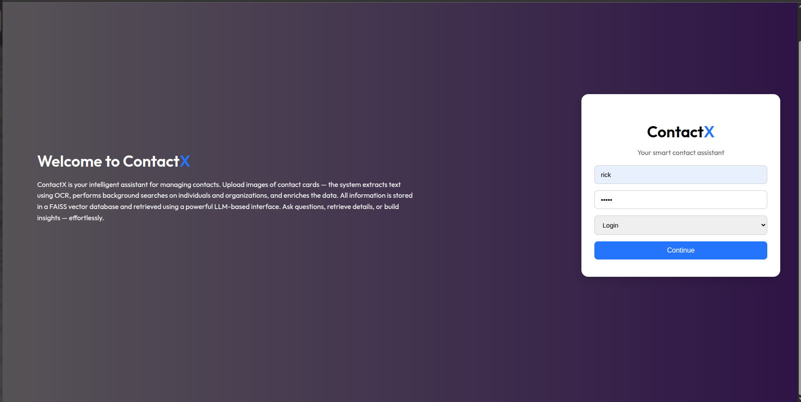
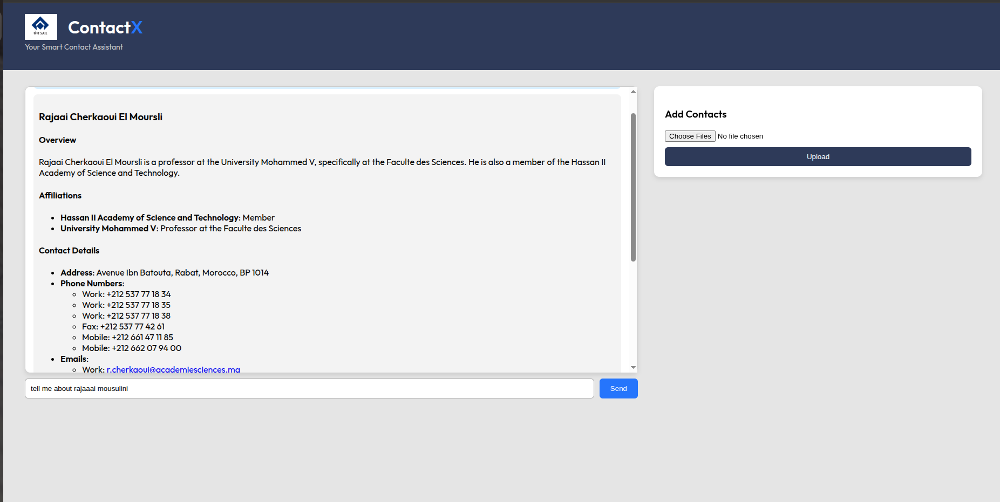

# ContactX – Intelligent Contact Management with RAG

**ContactX** is an AI-powered smart assistant for managing contact cards.  
It leverages **OCR**, **background search**, **FAISS vector DB**, **Conversational Memory**,and **LLM-based retrieval** to extract, enrich, and interact with contact data intelligently.

---

## 📸 What it does

- 🧾 Upload **contact card images**
- 🔍 Extracts text using **transformer-based OCR**
- 🕵️‍♂️ Performs background search (company & individual) using **Tavily API**
- 🧠 Enriches contact information and stores it in a **FAISS** vector DB
- 💡 Uses LangChain's FAISS retriever to index and search contact data intelligently
- 💬 Interacts with the data using **LLM** (Groq - `llama3-70b`)
- 🧠 Smart conversation using short-term Chat Memory for each session
- 🔐 Uses **JWT authentication** and **FastAPI logging**
- 🌐 Simple **Flask web frontend** with upload & chat UI

---

## 🏗️ Tech Stack

| Layer      | Tech                                                                 |
|------------|----------------------------------------------------------------------|
| Backend    | `FastAPI`, `FAISS`, `Tavily`, `Groq LLM`, `JWT`, `Pydantic`, `Uvicorn` , `langchain` |
| OCR        | [`ds4sd/SmolDocling-256M`](https://huggingface.co/ds4sd/SmolDocling-256M-preview) |
| LLM        | Groq API → `llama3-70b-versatile`                                    |
| Search     | Tavily Web API                                                       |
| Frontend   | `Flask`, `HTML`, `CSS`, `JS`                                         |

---

## ⚙️ Project Structure


``` bash
.
├── data
│   ├── img_database
│   ├── users.json
│   └── vector_dbs
|
├── frontend
│   ├── app.py
│   ├── static
│   │   ├── SAIL_Logo.png
│   │   ├── chat.js
│   │   ├── chatbot.css
│   │   └── style.css
│   └── templates
│       ├── chat.html
│       ├── index.html
│       └── login.html
|
├── notebooks
│   └── card_detection.ipynb

├── src
│   ├── __init__.py
│   ├── background_search.py
│   ├── chatbot.py
│   ├── database.py
│   ├── image_to_ocr.py
│   ├── llm.py
│   ├── ocr_to_dict.py
│   └── retriever.py
│
├── __init__.py
├── server.log
├── server.py
├── app.py
├── client.py
├── todo.md
└── README.md

```

---

## 🔌 API Endpoints

| Method | Route                         | Description                     |
| ------ | ----------------------------- | ------------------------------- |
| POST   | `/login-register`             | Login/Register with JWT         |
| GET    | `/user/{db_id}`               | Load vector index and chatbot   |
| POST   | `/users/{db_id}/query`        | Query using LLM+FAISS           |
| POST   | `/users/{db_id}/add_contacts` | Upload and add contacts via OCR |

---

## ▶️ Running the Project

### 1. Start Backend Server (FastAPI)

```bash
# from project root
fastapi run server.py
```

* Visit: [http://127.0.0.1:8000/docs](http://127.0.0.1:8000/docs) for Swagger UI

---

### 2. Start Frontend (Flask)

```bash
cd frontend
flask run
```

* Visit: [http://127.0.0.1:5000](http://127.0.0.1:5000)

---

## 📦 Example Usage (Swagger UI)

1. **Register/Login** using `/login-register`
   Payload (JWT-encoded JSON):

   ```json
   {
     "userid": "abc",
     "password": "1234",
     "action": "login"
   }
   ```

2. **Initialize Chatbot** using `/user/{db_id}`

3. **Upload Contact Images** to `/users/{db_id}/add_contacts`

4. **Query Contact Info** via `/users/{db_id}/query`

   ```json
   {
     "message": "Show me the contacts from Google"
   }
   ```

---

## 🔐 Security

* JWT-encoded login/register payloads
* Pydantic validation for all endpoints
* Logging for major operations (index loading, user login, etc.)

---

## ✨ Future Improvements

* [ ] Add contact tags (e.g., category: vendor, HR)
* [ ] Vector DB cleanup & management dashboard
* [ ] Dockerize and deploy on instance (AWS ec2)
* [ ] Add multiple server nodes and loadbalancing(cpp?) 
* [ ] linting (ruff?)
* [ ] Ci/Cd (github actions?)
* [ ] Eval / test scripts (pytest / autorag?)

---

## 👨‍💻 Author

**Manodeep Ray**

> Summer Intern – SAIL , meghahatuburu 
> ContactX: Solving contact chaos with AI.

---

## 📄 License

This project is open-source and available under the [MIT License](LICENSE).


## 🔍 Preview Screens

### 🔐 Login/Register



---


### 💬 Chat with ContactX



---

### 🖼️ Upload Contact Card example


---
